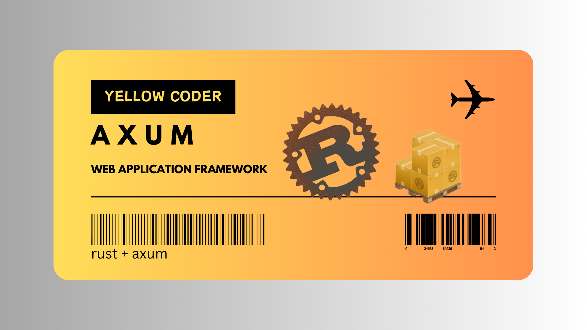

# Rust Web Application

This is a web application built using Rust and the Rocket web framework. It showcases how to build a modern and efficient web application with Rust's powerful concurrency and performance capabilities.

## Setup

1. Clone the repository: 
    > git clone https://https://github.com/shubhamlodhi/rusty-fork.git

2. Change to the project directory:
    > cd rusty-fork

3. Install the dependencies: 
    > cargo build

4. Start the server:
    > cargo run

## License

This project is licensed under the [MIT License](LICENSE).